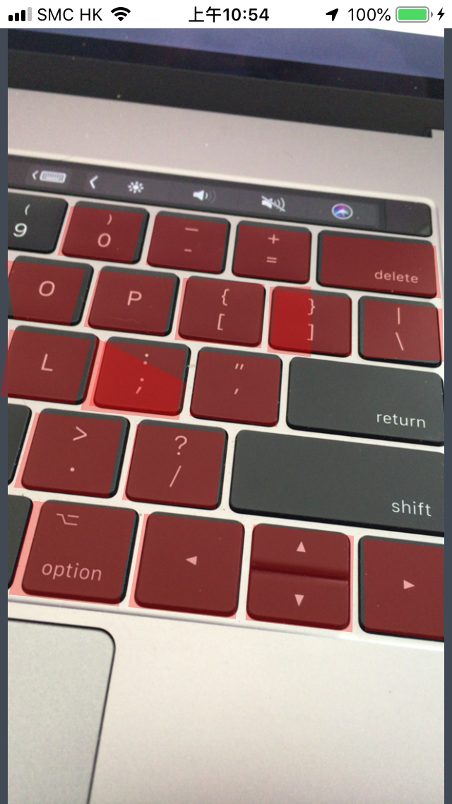

# Detect rectangles sample project.
Using Vision Framework to detect rectangles on live camera.

## Screen capture: 

## Install and build: 
- Create a new Xcdoe **Single View App** project
- Replace the **ViewController.swift** file to the new project

## Project references: 
[Vision Framework: Building on Core ML](https://developer.apple.com/videos/play/wwdc2017/506/)
